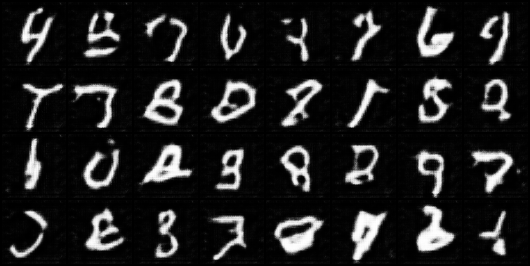
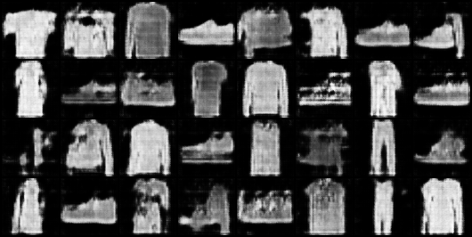

# Synthetic-Images-DCGANs

PyTorch implementation of Deep Convolutional GANs based on [Unsupervised Representation Learning With Deep Convolutional Generative Adversarial Networks](http://arxiv.org/abs/1511.06434).

The model currently supports MNIST, Fashion MNIST and CIFAR10 datasets. To add a dataset modify `data_loader.py`.

<h3> Training </h3>

You can train the model on MNIST by running
```python
python main.py --dataset MNIST
```
`main.py` also takes the following optional arguments
```
--batch_size      Input batch size            32
--beta1           Beta1 of Adam optimizer     0.5
--lr              Learning rate               0.0002
--epochs          No. of epochs to train      20
--feature_size    Size of random noise        100
```

You can create a GIF of the results by running
```python
python create_gif.py --dataset MNIST
```
<h3> Output </h3>

Output of generator after each epoch of training.

MNIST



Fashion MNIST


